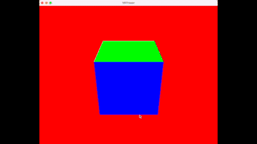

#  VRTracer

This is a personal project for learning Metal's Ray Tracing API with swift. The goal here is to have a flythrough camera that ray traces a simple cube. In order to achieve this we port `MTLRayTracingSample` from WWDC20 (written in objective-c) and use nlguillemot [flythrough_camera](https://github.com/nlguillemot/flythrough_camera) as starting points. This project is done with the simple educational purpose of learning the different stages of a physically-based renderer using the ray-tracing API of metal. Some obvious optimizations have been set aside in order not to obscure the different transformations involved. For a basic fly camera controller demo with Metal in swift, but using a *rasterizer* renderer, see warren's [tutorial](https://github.com/metal-by-example/MetalFlyCamera). 

### Results

A safe fly through this simple scene with a perspective camera :]

