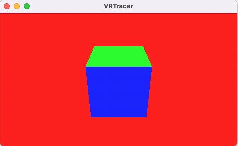

#  VRTracer

This is a personal project for learning Metal's Ray Tracing API with swift. The goal here is to have a flythrough camera that ray traces a simple cube. In order to achieve this we port `MTLRayTracingSample` from WWDC20 (written in objective-c) and use nlguillemot [flythrough_camera](https://github.com/nlguillemot/flythrough_camera) as starting points. This project is still under construction and some package dependencies are not visible.  

